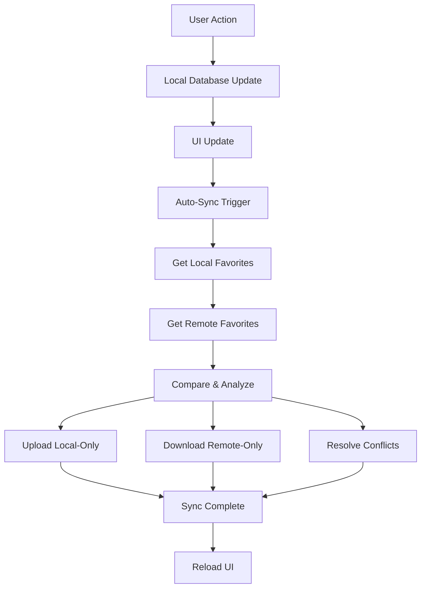

#  <#Title#>

# Tide Station Favorites Synchronization

## Overview

The Mariner Studio app includes a comprehensive bidirectional synchronization system for tide station favorites, allowing users to seamlessly sync their favorite stations across multiple devices through Supabase cloud storage.

---

## Architecture

### Core Components

1. **TideStationSyncService** - Singleton service managing all sync operations
2. **SupabaseManager** - Handles all remote database operations with comprehensive logging
3. **TideStationDatabaseService** - Manages local SQLite operations
4. **RemoteTideFavorite** - Data model matching Supabase table structure
5. **TideFavoritesViewModel** - UI integration for favorites view
6. **TidalHeightStationsViewModel** - UI integration for stations list

### Data Storage

#### Local Storage (SQLite)
- **Table:** `TideStationFavorites`
- **Columns:** 
  - `station_id` (TEXT, PRIMARY KEY) - NOAA station identifier
  - `is_favorite` (BOOLEAN) - Favorite status

#### Remote Storage (Supabase)
- **Table:** `user_tide_favorites`
- **Columns:**
  - `id` (UUID, PRIMARY KEY) - Auto-generated
  - `user_id` (UUID) - Links to authenticated user
  - `station_id` (TEXT) - NOAA station identifier
  - `is_favorite` (BOOLEAN) - Favorite status
  - `last_modified` (TIMESTAMP) - For conflict resolution
  - `device_id` (TEXT) - Identifies originating device

---

## Sync Process

### Bidirectional Sync Flow



### Sync Operations

#### 1. Upload Phase
- Identifies local favorites not present remotely
- Creates `RemoteTideFavorite` records
- Inserts into Supabase `user_tide_favorites` table
- Tracks success/failure for each station

#### 2. Download Phase
- Identifies remote favorites not present locally
- Calls `setTideStationFavorite()` for each station
- Updates local SQLite database
- Tracks success/failure for each station

#### 3. Conflict Resolution
- Applies "remote wins" strategy for conflicting stations
- Uses `last_modified` timestamp for comparison
- Updates local database to match remote state
- Tracks conflicts resolved

---

## Sync Triggers

### Automatic Sync Triggers

1. **App Launch/View Appear**
   - Triggers when TideFavoritesView appears
   - Throttled to maximum once every 5 minutes
   - Calls `performAutoSyncIfNeeded()`

2. **Favorite Toggle**
   - Triggers after user adds/removes favorites
   - 1-second delay to prevent rapid multiple syncs
   - Calls `performAutoSyncAfterFavoriteToggle()`

3. **Pull-to-Refresh**
   - User pulls down on favorites list
   - Refreshes data AND triggers sync
   - Immediate sync after data reload

### Manual Sync Triggers

1. **Sync Button (Toolbar)**
   - Blue sync icon in navigation bar
   - Rotates during sync operation
   - Color indicates sync status

2. **Sync Button (Status Bar)**
   - Located in sync status bar above list
   - Shows "Sync" text with icon
   - Disabled during active sync

---

## User Interface Integration

### TideFavoritesView

#### Sync Status Bar
- **Location:** Above the favorites list
- **Components:**
  - Status icon (icloud.slash, checkmark.icloud.fill, etc.)
  - Status text ("Last sync: 2:30 PM", "Syncing...", etc.)
  - Manual sync button
- **Messages:**
  - Success messages (auto-dismiss after 3 seconds)
  - Error messages (persist until user dismisses)

#### Toolbar Sync Button
- **Icon:** Dynamic based on sync status
  - `icloud.slash` - Never synced (gray)
  - `checkmark.icloud.fill` - Successfully synced (green)
  - `exclamationmark.icloud` - Sync error (orange)
  - `arrow.clockwise` - Syncing (blue, rotating)

### TidalHeightStationsView

#### Auto-Sync Integration
- Automatically syncs when users toggle favorites
- No UI indication (background operation)
- Comprehensive logging for troubleshooting

---

## Data Models

### RemoteTideFavorite
```swift
struct RemoteTideFavorite: Codable, Identifiable {
    let id: UUID?                    // Supabase-generated
    let userId: UUID                 // Current user
    let stationId: String           // NOAA station ID
    let isFavorite: Bool            // Favorite status
    let lastModified: Date          // Conflict resolution
    let deviceId: String            // Originating device
}
```

### TideSyncResult
```swift
enum TideSyncResult {
    case success(TideSyncStats)                    // All operations succeeded
    case failure(TideSyncError)                    // Sync failed completely
    case partialSuccess(TideSyncStats, [TideSyncError])  // Some operations failed
}
```

### TideSyncStats
```swift
struct TideSyncStats {
    let operationId: String         // Unique operation identifier
    let startTime: Date            // Sync start timestamp
    let endTime: Date              // Sync completion timestamp
    let localFavoritesFound: Int   // Local favorites count
    let remoteFavoritesFound: Int  // Remote favorites count
    let uploaded: Int              // Successfully uploaded
    let downloaded: Int            // Successfully downloaded
    let conflictsResolved: Int     // Conflicts resolved
    let errors: Int                // Total errors encountered
}
```

---

## Error Handling

### Error Types

```swift
enum TideSyncError: Error {
    case authenticationRequired    // User not logged in
    case networkUnavailable       // No internet connection
    case supabaseError(String)    // Remote database error
    case databaseError(String)    // Local database error
    case conflictResolutionFailed(String)  // Conflict resolution error
    case unknownError(String)     // Unexpected error
}
```

### Error Recovery

1. **Authentication Errors**
   - User must sign in to enable sync
   - Sync disabled until authentication restored

2. **Network Errors**
   - Sync retries automatically on next trigger
   - Local changes preserved until network restored

3. **Database Errors**
   - Logged with detailed error information
   - User notified via error messages

---

## Logging System

### Log Levels and Prefixes

- `🟢🌊` - Sync operation start
- `🔐🌊` - Authentication operations
- `💾🌊` - Database operations
- `📱🌊` - Local data operations
- `☁️🌊` - Remote data operations
- `🔍🌊` - Data analysis phase
- `📤🌊` - Upload operations
- `📥🌊` - Download operations
- `🔧🌊` - Conflict resolution
- `🏁🌊` - Final results
- `✅🌊` - Success operations
- `❌🌊` - Error operations
- `⚠️🌊` - Warning operations

### Sample Log Output

```
🟢🌊 FULL SYNC START: ===================================================
🔐🌊 AUTH CHECK: Starting authentication verification...
✅🔐🌊 AUTH SUCCESS: Session retrieved successfully
📱🌊 LOCAL DATA: Starting local favorites retrieval...
✅📱🌊 LOCAL DATA SUCCESS: Retrieved local favorites - Count = 5
☁️🌊 REMOTE DATA: Starting remote favorites retrieval...
✅☁️🌊 REMOTE DATA SUCCESS: Retrieved remote favorites - Count = 3
🔍🌊 ANALYSIS: Local favorites count = 5, Remote records count = 3
📤🌊 UPLOAD PHASE: Stations to upload = 2
✅📤🌊 UPLOAD SUCCESS: Station 8578240
📥🌊 DOWNLOAD PHASE: Stations to download = 0
🔧🌊 CONFLICT PHASE: Conflicts to resolve = 3
✅🔧🌊 CONFLICT RESOLVED: Station 8571421
🏁🌊 SYNC COMPLETE: 5 operations in 1.234s
```

---

## Performance Considerations

### Sync Throttling

1. **Auto-Sync Throttling**
   - Maximum once every 5 minutes for app-launch sync
   - 1-second delay for favorite-toggle sync

2. **Concurrent Sync Prevention**
   - Only one sync operation allowed at a time
   - Subsequent requests ignored during active sync

3. **Race Condition Detection**
   - Comprehensive logging identifies concurrent operations
   - Operation tracking prevents data corruption

### Network Optimization

1. **Efficient Queries**
   - Single query to retrieve all user favorites
   - Minimal data transfer with targeted updates

2. **Batch Operations**
   - Multiple uploads/downloads processed efficiently
   - Comprehensive error tracking per operation

---

## Configuration

### Service Access

```swift
// Manual sync trigger
let result = await TideStationSyncService.shared.syncTideStationFavorites()

// Check sync availability
let canSync = await TideStationSyncService.shared.canSync()

// Get current operations (debugging)
let activeOps = TideStationSyncService.shared.getCurrentSyncOperations()

// Print performance statistics
TideStationSyncService.shared.printSyncStats()
```

### ViewModel Integration

```swift
// TideFavoritesViewModel
await viewModel.syncWithCloud()                    // Manual sync
await viewModel.performAutoSyncIfNeeded()          // Auto-sync with throttling
await viewModel.performAutoSyncAfterChange()       // Auto-sync after changes

// TidalHeightStationsViewModel  
await viewModel.performAutoSyncAfterFavoriteToggle() // Auto-sync after toggle
```

---

## Security Considerations

### Authentication
- All sync operations require valid Supabase session
- User-specific data isolation via `user_id` filtering
- Automatic session validation before sync operations

### Data Privacy
- Device identification for conflict resolution
- No personally identifiable information in sync data
- User can only access their own favorites

### Network Security
- All communications over HTTPS
- Supabase handles authentication tokens
- No sensitive data stored in local logs

---

## Troubleshooting

### Common Issues

1. **Sync Not Working**
   - Check user authentication status
   - Verify network connectivity
   - Review sync logs for specific errors

2. **Favorites Not Appearing**
   - Ensure sync completed successfully
   - Check for conflict resolution in logs
   - Verify remote data exists in Supabase

3. **Multiple Device Issues**
   - Confirm same user account on all devices
   - Check last sync times across devices
   - Review conflict resolution logs

### Debug Commands

```swift
// Enable verbose logging
TideStationSyncService.shared.enableVerboseLogging()

// Print current state
TideStationSyncService.shared.logCurrentState()

// Print performance statistics
TideStationSyncService.shared.printSyncStats()

// Check active operations
let ops = TideStationSyncService.shared.getCurrentSyncOperations()
print("Active sync operations: \(ops)")
```

---

## File Locations

```
Mariner Studio/
├── Services/Sync/
│   └── TideStationSyncService.swift
├── Models/Sync/
│   ├── RemoteTideFavorite.swift
│   └── TideSyncModels.swift
├── Services/Database/
│   └── TideStationDatabaseService.swift (enhanced)
├── ViewModels/
│   ├── TideFavoritesViewModel.swift (enhanced)
│   └── TidalHeightStationsViewModel.swift (enhanced)
├── Views/
│   └── TideFavoritesView.swift (enhanced)
└── Documentation/
    └── TideStationSync.md (this file)
```

---

## Future Enhancements

### Potential Improvements

1. **Offline Sync Queue**
   - Queue sync operations when offline
   - Process queue when network restored

2. **Selective Sync**
   - Allow users to choose sync frequency
   - Option to disable auto-sync

3. **Sync Statistics UI**
   - Display sync history to users
   - Show sync performance metrics

4. **Advanced Conflict Resolution**
   - User choice for conflict resolution strategy
   - Manual conflict resolution interface

---

## Version History

- **v1.0** - Initial implementation with bidirectional sync
- **Future** - Enhanced features based on user feedback
